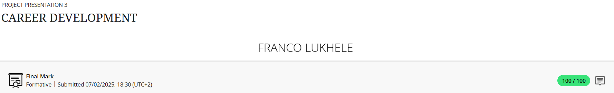
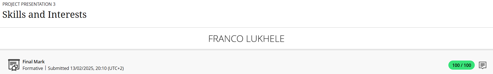
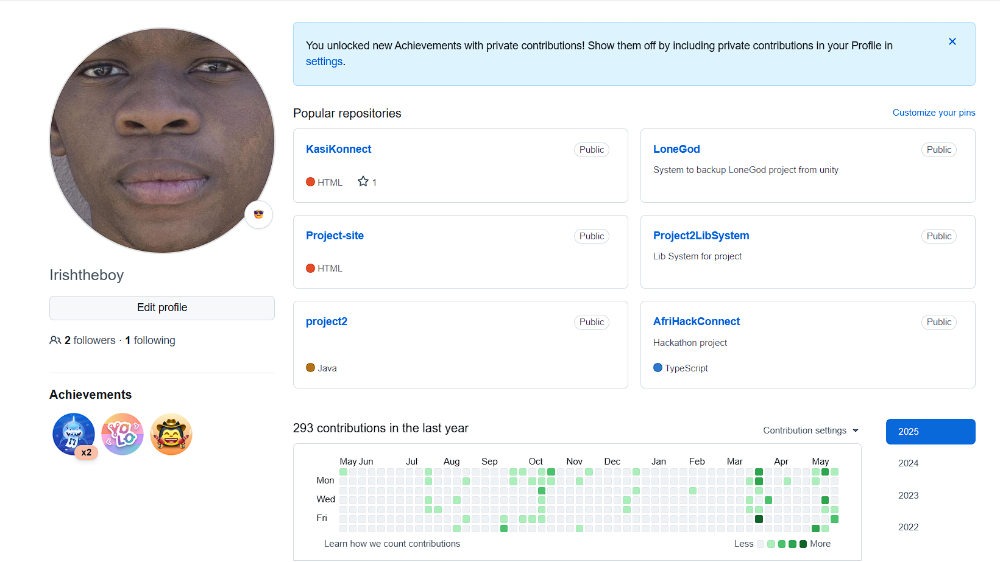
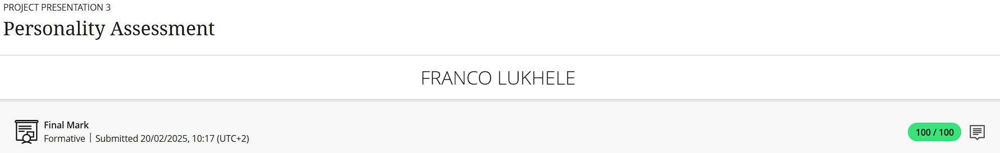

# 🎓 PRP370S Digital Portfolio – *Franco Lukhele*

Welcome to my **Work Readiness Portfolio**, created as part of the PRP370S module at the Cape Peninsula University of Technology. This digital collection highlights my journey, skills, and professional development with a focus on **game development**—my greatest passion.

---

## 📁 Portfolio Overview

- [💼 Career Counselling](#-career-counselling)
- [🧠 Skills & Interests](#-skills--interests)
- [🧬 Personality Assessment](#-personality-assessment)
- [📄 CV](#-cv)
- [💬 Business Communication](#-business-communication)
- [💼 Interview Skills](#-interview-skills)
- [💼 Mock Interview](#-mock-interview)
- [🌐 Professional Networking](#-professional-networking)
- [💼 Workplace Etiquette](#-workplace-etiquette)
- [🔄 Final Reflections](#-final-reflections)

---

## 💼 Career Counselling

### 📸 Evidence  

### ✍️ Reflection (STAR)

**Situation:**
During the Work Readiness programme, I completed a self-assessment to evaluate my strengths, interests, and technical capabilities.

**Task:**  
Explore and clarify career opportunities that align with my game development goals.

**Action:**  
Discussed my academic journey and technical interests with a career advisor. Together, we mapped out pathways such as Unity Developer, Gameplay Programmer, and Technical Artist.

**Result:**  
Gained direction and was encouraged to develop a strong portfolio, contribute to open-source projects, and apply for internships at studios like **Sea Monster** or **Free Lives**.

---

## 🧠 Skills & Interests

### 📸 Evidence  
#### 📌 Work Readiness Exercise  
  

#### 📌 GitHub Activity (Evidence of Practice)  

### ✍️ Reflection (STAR)

**Situation:**  
As part of the Work Readiness program, I completed a self-assessment to discover my strongest skills and interests.

**Task:**  
Evaluate how my existing skills align with industry demands in game development.

**Action:**  
Assessed my strengths in **Unity**, **C#**, **version control (Git)**, and **3D asset integration**. I actively developed [**LoneGod**](https://github.com/Irishtheboy/LoneGod), a solo game project that showcases gameplay mechanics, scripting, and environment design. I also contribute to online game dev communities for feedback and growth.

**Result:**  
This reflection solidified my focus on game development. LoneGod has become a cornerstone of my portfolio and a demonstration of my problem-solving and creative capabilities.

---

## 🧬 Personality Assessment

### 📸 Evidence  

### ✍️ Reflection (STAR)

**Situation:**  
Completed a personality profiling assessment during the career readiness module.

**Task:**  
Understand how my personality influences my work preferences and career suitability.

**Action:**  
Analyzed results that highlighted traits like introversion, creativity, and attention to detail. Discussed these with a mentor to find connections with roles in the creative tech space.

**Result:**  
This insight explained my love for solo game jams, debugging, and immersive storytelling. I'm now more confident in pursuing roles like Gameplay Programmer or Indie Game Designer.

---

## 📄 CV

### 📎 [📄 View My CV (PDF)](./FrancoLukhele.pdf)

### ✍️ Reflection (STAR)

**Situation:**  
Required to design a professional CV to apply for internships and jobs.

**Task:**  
Build a game dev-oriented CV that reflects both technical and creative experiences.

**Action:**  
Used a modern, ATS-friendly template. Emphasized my Unity/C# skills, linked to GitHub projects, and added academic projects. I included my work using **MetaHuman**, where I design photorealistic characters for cinematic scenes in Unreal Engine. Received feedback from an industry peer and a CPUT lecturer.

**Result:**  
I now have a polished, role-specific CV that has already been used to apply for two internships and is ready for networking events.

---
## 💬 Business Communication  

### 📸 Evidence  
add image here pls franco

### ✍️ Reflection (STAR)

**Situation:**  
At the beginning of the Business Communication module, I struggled to write professional emails because English is not my first language. I often felt unsure about the correct tone, structure, and choice of words to use when communicating formally.  

**Task:**  
My goal was to improve my understanding of formal and informal communication, especially in writing business emails that sound professional and respectful.  

**Action:**  
I completed several interactive lessons that explained the difference between formal and informal tones. I also learned how to structure an email properly — from the greeting and subject line to the sign-off. Through practice activities, I applied what I learned by writing sample emails for different workplace scenarios. I made sure to check grammar, spelling, and tone before sending messages.  

**Result:**  
After completing the task, I now feel much more confident writing and sending professional emails. I understand how tone affects how others perceive my message, and I can easily adjust my writing depending on the audience and context. This experience has helped me communicate more clearly and confidently in both academic and professional settings.

---
## 💼 Interview Skills  

### 📸 Evidence  
add image here please franco

### ✍️ Reflection (STAR)

**Situation:**  
Before learning about interview skills, I used to feel extremely nervous about job interviews. I was unsure how to present myself professionally, answer questions confidently, or handle unexpected scenarios during interviews.  

**Task:**  
My goal was to improve my interviewing technique, understand proper interview etiquette, and learn how to respond effectively to common and behavioral interview questions.  

**Action:**  
I studied the key aspects of successful interviewing, including interview etiquette, preparation strategies, and the CAR method for behavioral questions. I learned to:  
- Arrive early, dress appropriately, and maintain positive body language.  
- Research the company, review my resume, and understand my “why” for applying.  
- Create a story bank of past achievements and experiences to draw examples from.  
- Rehearse answers to common questions like strengths, weaknesses, goals, and “Tell me about yourself.”  
- Use the CAR method (Context, Action, Result) to answer behavioral questions clearly and positively.  
- Prepare thoughtful questions to ask the interviewer and follow up with a thank-you email.  

**Result:**  
After applying these strategies, I now feel much more confident and prepared for interviews. I can articulate my skills, experiences, and motivations clearly, respond effectively to behavioral questions, and make a positive impression through professional etiquette and body language. This training has reduced my anxiety and increased my chances of succeeding in future job interviews.

---

## 💼 Mock Interview  

### 📸 Evidence  
add image here pls franco

### ✍️ Reflection (STAR)

**Situation:**  
I participated in a mock interview to practice the skills I had learned in my interview skills training. This was a controlled environment where I could receive feedback on my performance without the pressure of a real job interview.  

**Task:**  
The objective was to apply interview etiquette, demonstrate my knowledge and experience, and respond confidently to both common and behavioral interview questions. I also wanted to identify areas for improvement before attending actual interviews.  

**Action:**  
During the mock interview, I:  
- Arrived on time, dressed professionally, and maintained good posture and eye contact.  
- Answered questions using my story bank and applied the CAR method for behavioral questions.  
- Practiced responding clearly and concisely to questions like “Tell me about yourself,” “What are your strengths and weaknesses,” and “Where do you see yourself in five years?”  
- Asked thoughtful questions at the end of the interview to show engagement and interest.  
- Paid attention to feedback from the interviewer regarding my responses, body language, and overall presentation.  

**Result:**  
The mock interview helped me gain confidence and improved my ability to articulate my skills and experiences. I received constructive feedback that highlighted both my strengths and areas to work on, such as speaking more slowly at times and providing more detailed examples. Overall, this exercise made me feel better prepared for real job interviews and more capable of leaving a strong impression.

---

## 🌐 Professional Networking  

### 📸 Evidence  

### ✍️ Reflection (STAR)

**Situation:**  
During my course, I learned about professional networking and its importance in building a successful career. The lesson highlighted how networking is more than exchanging business cards—it’s about creating genuine, ongoing relationships that can support both personal and professional growth.  

**Task:**  
My goal was to understand how to build and maintain a professional network, identify opportunities to meet new contacts, and learn strategies to nurture these connections effectively. I also wanted to apply this knowledge in practical scenarios, such as reaching out to mentors or industry professionals.  

**Action:**  
To practice professional networking, I:  
- Identified people in my existing network, including friends, family, classmates, and past colleagues, who could provide guidance or introductions.  
- Used online platforms like LinkedIn to connect with professionals in my field and engaged with their posts and content.  
- Attended career-oriented and social events to meet new people and introduce myself professionally.  
- Focused on offering value to my connections, such as sharing useful articles, congratulating them on achievements, or providing assistance when possible.  
- Maintained my network by keeping a spreadsheet of contacts, scheduling regular check-ins, and performing periodic audits to ensure relationships stayed active and meaningful.  

**Result:**  
I gained a better understanding of the power of networking and how it can open doors to job opportunities, mentorship, and industry knowledge. By actively engaging and nurturing my network, I improved my social confidence, strengthened professional relationships, and became more proactive in seeking and providing support. This experience showed me that networking is a long-term investment that pays off when done thoughtfully and consistently.

---

## 💼 Workplace Etiquette  

### 📸 Evidence  
  

### ✍️ Reflection (STAR)

**Situation:**  
During the Work Readiness course, I explored workplace etiquette and professional conduct. I noticed that professionalism goes beyond job titles or clothing—it’s about how you interact, communicate, and behave in different work settings.  

**Task:**  
I wanted to learn how to act professionally in various environments, including offices, remote setups, and hybrid workplaces, while building respect and credibility with colleagues and supervisors.  

**Action:**  
I engaged with practical examples such as customer service calls, office promotions, and professional meetings. I focused on:  
- Treating everyone with courtesy and respect, regardless of their position.  
- Being reliable and accountable by meeting deadlines and taking ownership of tasks.  
- Upholding ethical standards and following company policies.  
- Communicating clearly, checking understanding, and avoiding gossip or oversharing.  
- Managing emotions and staying composed during conflicts or challenges.  
- Dressing appropriately, keeping work areas tidy, and observing office norms like punctuality.  

**Result:**  
I now recognize that workplace etiquette plays a crucial role in career development. Demonstrating professionalism fosters trust, strengthens relationships, and enhances my reputation. I feel confident applying these principles in any setting, knowing they support my growth as a responsible and respected professional.  

---

## 🔄 Final Reflections

This portfolio showcases my professional and personal growth throughout the PRP370S module. It not only highlights my passion for game development but also reflects my development in work readiness skills, professional communication, and workplace professionalism.

### 💡 Key Takeaways:
- 🎯 Career counselling helped me clarify my goals and identify pathways in game development.  
- 🛠️ Understanding my personality gave me insight into how my strengths and preferences align with roles in the creative tech industry.  
- 🧰 STAR reflections allowed me to organize my experiences into structured, career-ready narratives.  
- 💬 Business Communication and Interview Skills modules improved my confidence in professional interactions, email etiquette, and interview preparedness.  
- 💼 Learning about Workplace Etiquette taught me how to behave responsibly, respectfully, and ethically in office, remote, and hybrid settings. I now know how professionalism impacts relationships, reputation, and career progression.  
- 📂 I’ve created a comprehensive portfolio and CV that accurately reflects my skills, achievements, and readiness to enter the professional world.  

---

> 🧠 Maintained by **Franco Lukhele** | `IT Student @ CPUT` | 🎮 *Game Dev Enthusiast*  
> "Turning creative visions into playable realities, one line of code at a time."
